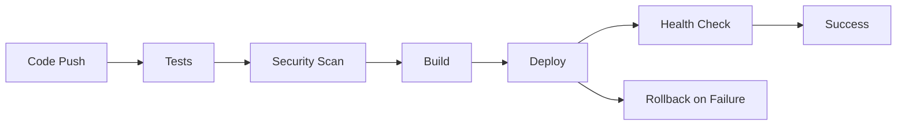

# 🚀 CI/CD Guide for EcoBottle

## Overview

EcoBottle uses a comprehensive CI/CD pipeline with GitHub Actions for automated testing, security scanning, and deployment to AWS EC2.

## Workflows

### 🧪 1. Main Deployment Pipeline (`deploy.yml`)

**Triggers:**
- Push to `main` branch → Production deployment  
- Push to `develop` branch → Staging deployment
- Manual trigger → Choose environment

**Stages:**
1. **Test & Build** - Lint, type-check, build frontend & backend
2. **Security Scan** - Trivy vulnerability scanning, npm audit
3. **Deploy** - Deploy to selected environment with health checks
4. **Rollback** - Automatic rollback on failure

### 🌍 2. Environment Deployment (`environment-deploy.yml`)

**Features:**
- Manual deployment to any environment
- Force rebuild option
- Database migrations
- Environment-specific configurations

### 🔥 3. Hotfix Deployment (`hotfix.yml`)

**Use Cases:**
- Emergency production fixes
- Skip tests option for critical issues
- Automatic backup before deployment
- Emergency rollback capability

### 🔐 4. Secrets Management (`setup-secrets.yml`)

**Features:**
- Deploy secrets securely to servers
- Rotate security secrets
- Validate secret configuration
- Graceful restart with new secrets

### 🔍 5. Secrets Verification (`verify-secrets.yml`)

**Checks:**
- All required secrets are present
- SSH connectivity to servers
- Database/Redis connection validation
- Secret format verification

## Environment Configuration

### Production
- **Host:** `ec2-13-125-17-12.ap-northeast-2.compute.amazonaws.com`
- **Database:** AWS RDS PostgreSQL
- **Cache:** AWS ElastiCache Redis
- **Features:** Full monitoring, rate limiting, backup

### Staging  
- **Host:** Same EC2 (different subdomain)
- **Database:** Staging database
- **Cache:** Staging Redis
- **Features:** Debug logging, no rate limiting

## Quick Start

### 1. Setup Secrets

```bash
# Run the automated setup
./setup-github-secrets.sh
```

### 2. Configure SSH Access

```bash
# Ensure you have EC2 SSH access
ssh ubuntu@ec2-13-125-17-12.ap-northeast-2.compute.amazonaws.com

# Or run the SSH setup script
./setup-ssh-key.sh
```

### 3. Deploy

Go to **GitHub Actions** → **Deploy EcoBottle**:
1. Select environment (staging/production)
2. Click "Run workflow"
3. Monitor deployment progress

## Deployment Process

### Automatic Deployment



### Manual Deployment

1. **Environment Deploy** - Choose environment and options
2. **Hotfix Deploy** - Emergency fixes with backup
3. **Secrets Setup** - Manage deployment secrets

## Security Features

### 🔐 Secret Management
- GitHub repository secrets
- Environment-specific secrets
- Automatic secret rotation
- Secure transmission to servers

### 🛡️ Security Scanning
- Trivy vulnerability scanning
- npm audit for dependencies
- SARIF upload to GitHub Security
- CodeQL security analysis

### 🔒 Access Control
- SSH key-based authentication
- Environment protection rules
- Branch protection requirements
- Two-factor authentication

## Monitoring & Alerts

### Health Checks
- API endpoint verification
- Frontend accessibility
- Database connectivity
- Redis cache availability

### Deployment Metrics
- Build success rate
- Deployment duration
- Failure recovery time
- Security scan results

### Notifications
- Slack/Discord webhooks
- GitHub deployment status
- Email notifications
- Grafana alerts

## Troubleshooting

### Deployment Failures

```bash
# Check GitHub Actions logs
# SSH to server and check containers
ssh ubuntu@your-ec2-host
cd /home/ubuntu/ecobottle
docker-compose -f docker-compose.simple.yml -f docker-compose.aws.yml logs

# Check service health
curl -sf http://localhost/health
```

### Secret Issues

```bash
# Verify secrets are deployed
ssh ubuntu@your-ec2-host "ls -la /etc/ecobottle/secrets/"

# Re-run secrets setup
# Go to Actions → Setup Deployment Secrets
```

### SSH Connection Problems

```bash
# Test SSH connection locally
ssh -i ~/.ssh/your-key.pem ubuntu@your-ec2-host

# Check key permissions
chmod 600 ~/.ssh/your-key.pem

# Verify key matches EC2 instance
```

## Advanced Features

### Database Migrations

Automatic database migrations during deployment:
- Prisma schema changes
- Data migrations
- Rollback on failure

### Blue-Green Deployment

Future enhancement for zero-downtime deployments:
- Deploy to secondary environment
- Health check validation
- Traffic switching
- Rollback capability

### Multi-Region Deployment

Planned features:
- Multiple AWS regions
- Load balancing
- Disaster recovery
- Data replication

## Best Practices

### Development Workflow

1. **Feature Branch** → Create from `develop`
2. **Pull Request** → Code review required
3. **Staging Deploy** → Merge to `develop`
4. **Production Deploy** → Merge to `main`

### Security Practices

1. **Secret Rotation** → Monthly automatic rotation
2. **Vulnerability Scanning** → Every deployment
3. **Access Monitoring** → Log all deployments
4. **Backup Strategy** → Before every deployment

### Performance Optimization

1. **Parallel Builds** → Frontend & backend
2. **Docker Layer Caching** → Faster builds
3. **Health Checks** → Fast failure detection
4. **Incremental Deployment** → Only changed services

## Maintenance

### Weekly Tasks
- Review deployment metrics
- Check security scan results
- Verify backup systems
- Update dependencies

### Monthly Tasks
- Rotate all secrets
- Review access permissions
- Update deployment documentation
- Test disaster recovery

### Quarterly Tasks
- Security audit
- Performance optimization
- Infrastructure review
- Cost optimization

## Support

### Documentation
- `SECRETS-SETUP.md` - Detailed secrets configuration
- `AWS-DEPLOYMENT.md` - Infrastructure setup
- `MONITORING.md` - Observability guide

### Scripts
- `setup-github-secrets.sh` - Automated secrets setup
- `setup-ssh-key.sh` - SSH key configuration
- `deploy-to-ec2.sh` - Manual deployment script

### Monitoring
- **Grafana:** http://your-host/grafana
- **Prometheus:** http://your-host/prometheus
- **Application:** http://your-host
